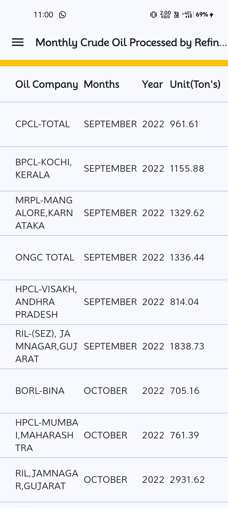

# Refineries

# Overview
Refineries is a simple application designed to demonstrate how routing can be performed between pages using the go_router package. It also showcases how app states are managed with the flutter_riverpod state management library.

## Technology Used
  - **Routing** go_router
  - **State Management** flutter_riverpod
  - **Flutter** 
  - **Dart** 

## Screenshots
<div style=align-items: center;>
  
  
</div>

## Installation

1. **Clone the Repository**
   ```bash
   git clone https://github.com/Ankush1200/refineries_task.git

2. **Install dependencies**
   ```bash
   flutter pub get
3. **Run the app**
   ```bash
   flutter run

## Contribution
Contributions are welcome! Please fork this repository and submit a pull request for any feature enhancements or bug fixes.

## Contact
  - **GitHub**: https://github.com/Ankush1200.
